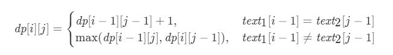
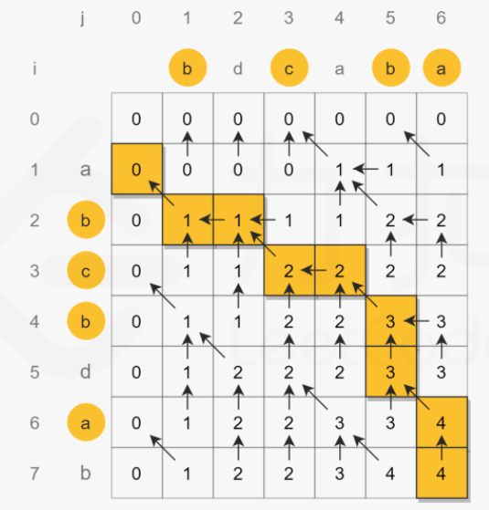

## Leetcode 题解 - 动态规划

* [最长递增子序列](#最长递增子序列)
  * [1. 最长递增子序列](#1-最长递增子序列)
  * [2. 一组整数对能够构成的最长链](#2-一组整数对能够构成的最长链)
  * [3. 最长摆动子序列](#3-最长摆动子序列)
* [最长公共子序列](#最长公共子序列)
  * [1. 最长公共子序列](#1-最长公共子序列)
* [0-1 背包](#0-1-背包)
  * [1. 划分数组为和相等的两部分](#1-划分数组为和相等的两部分)
  * [2. 改变一组数的正负号使得它们的和为一给定数](#2-改变一组数的正负号使得它们的和为一给定数)
  * [3. 01 字符构成最多的字符串](#3-01-字符构成最多的字符串)
  * [4. 找零钱的最少硬币数](#4-找零钱的最少硬币数)
  * [5. 找零钱的硬币数组合](#5-找零钱的硬币数组合)
  * [6. 字符串按单词列表分割](#6-字符串按单词列表分割)
  * [7. 组合总和](#7-组合总和)
* [股票交易](#股票交易)
  * [1. 需要冷却期的股票交易](#1-需要冷却期的股票交易)
  * [2. 需要交易费用的股票交易](#2-需要交易费用的股票交易)
  * [3. 只能进行两次的股票交易](#3-只能进行两次的股票交易)
  * [4. 只能进行 k 次的股票交易](#4-只能进行-k-次的股票交易)
* [字符串编辑](#字符串编辑)
  * [1. 删除两个字符串的字符使它们相等](#1-删除两个字符串的字符使它们相等)
  * [2. 编辑距离](#2-编辑距离)
  * [3. 复制粘贴字符](#3-复制粘贴字符)
    <!-- GFM-TOC -->

## 最长递增子序列

已知一个序列 {S<sub>1</sub>, S<sub>2</sub>,...,S<sub>n</sub>}，取出若干数组成新的序列 {S<sub>i1</sub>, S<sub>i2</sub>,..., S<sub>im</sub>}，其中 i1、i2 ... im 保持递增，即新序列中各个数仍然保持原数列中的先后顺序，称新序列为原序列的一个  **子序列**  。

如果在子序列中，当下标 ix > iy 时，S<sub>ix</sub> > S<sub>iy</sub>，称子序列为原序列的一个  **递增子序列**  。

定义一个数组 dp 存储最长递增子序列的长度，dp[n] 表示以 S<sub>n</sub> 结尾的序列的最长递增子序列长度。对于一个递增子序列 {S<sub>i1</sub>, S<sub>i2</sub>,...,S<sub>im</sub>}，如果 im < n 并且 S<sub>im</sub> < S<sub>n</sub>，此时 {S<sub>i1</sub>, S<sub>i2</sub>,..., S<sub>im</sub>, S<sub>n</sub>} 为一个递增子序列，递增子序列的长度增加 1。满足上述条件的递增子序列中，长度最长的那个递增子序列就是要找的，在长度最长的递增子序列上加上 S<sub>n</sub> 就构成了以 S<sub>n</sub> 为结尾的最长递增子序列。因此 dp[n] = max{ dp[i]+1 | S<sub>i</sub> < S<sub>n</sub> && i < n} 。

因为在求 dp[n] 时可能无法找到一个满足条件的递增子序列，此时 {S<sub>n</sub>} 就构成了递增子序列，需要对前面的求解方程做修改，令 dp[n] 最小为 1，即：

<!--<div align="center"></div> <br>-->

<div align="center">  </div><br>
对于一个长度为 N 的序列，最长递增子序列并不一定会以 S<sub>N</sub> 为结尾，因此 dp[N] 不是序列的最长递增子序列的长度，需要遍历 dp 数组找出最大值才是所要的结果，max{ dp[i] | 1 <= i <= N} 即为所求。

### 1. 最长递增子序列

300\. Longest Increasing Subsequence (Medium)

[Leetcode](https://leetcode.com/problems/longest-increasing-subsequence/description/) / [300. 最长递增子序列](https://leetcode-cn.com/problems/longest-increasing-subsequence/)

```js
给你一个整数数组 nums ，找到其中最长严格递增子序列的长度。
子序列是由数组派生而来的序列，删除（或不删除）数组中的元素而不改变其余元素的顺序。
例如，[3,6,2,7] 是数组 [0,3,1,6,2,2,7] 的子序列。

输入：nums = [10,9,2,5,3,7,101,18]
输出：4
解释：最长递增子序列是 [2,3,7,101]，因此长度为 4 。

输入：nums = [0,1,0,3,2,3]
输出：4

输入：nums = [7,7,7,7,7,7,7]
输出：1

[4,10,4,3,8,9]
3
[3,5,6,2,5,4,19,5,6,7,12]  
6 
进阶：你能将算法的时间复杂度降低到 #O(nlog(n)) 吗?
```

1


2


3


4


5


- **转移方程：** `dp[i] = max(dp[i], dp[j] + 1) for j in [0, i)`。

```java
// 时间O(N*N) 空间O(N)
// 73ms,62%
class Solution {
    public int lengthOfLIS(int[] nums) {
        if(nums.length == 0) return 0;
        int[] dp = new int[nums.length];
        int res = 0;
        Arrays.fill(dp, 1);//含义是每个元素都至少可以单独成为子序列，此时长度都为 1。
        for(int i = 0; i < nums.length; i++) {//当前数字
            for(int j = 0; j < i; j++) {//遍历当前数前面的，比当前数字小的有几个
                if(nums[j] < nums[i]) dp[i] = Math.max(dp[i], dp[j] + 1);
            }						    //dp[j] + 1是在比自己小的那位的比自己小的个数+1
            res = Math.max(res, dp[i]);
        }
        return res;
    }
}
```

```js
res = Math.max(res, dp[i]); 处理如下
输入：[1,3,6,7,9,4,10,5,6]
输出：[1, 2, 3, 4, 5, 3, 6, 4, 5]
```

其他题解

```java
public int lengthOfLIS(int[] nums) {
    int n = nums.length;
    int[] dp = new int[n];
    for (int i = 0; i < n; i++) {
        int max = 1;
        for (int j = 0; j < i; j++) {
            if (nums[i] > nums[j]) {
                max = Math.max(max, dp[j] + 1);
            }
        }
        dp[i] = max;
    }
    return Arrays.stream(dp).max().orElse(0);
}
```

使用 Stream 求最大值会导致运行时间过长，可以改成以下形式：

```java
int ret = 0;
for (int i = 0; i < n; i++) {
    ret = Math.max(ret, dp[i]);
}
return ret;
```

以上解法的时间复杂度为 O(N<sup>2</sup>)，可以使用二分查找将时间复杂度降低为 O(NlogN)。

定义一个 tails 数组，其中 tails[i] 存储长度为 i + 1 的最长递增子序列的最后一个元素。对于一个元素 x，

- 如果它大于 tails 数组所有的值，那么把它添加到 tails 后面，表示最长递增子序列长度加 1；
- 如果 tails[i-1] \< x \<= tails[i]，那么更新 tails[i] = x。

例如对于数组 [4,3,6,5]，有：

```html
tails      len      num
[]         0        4
[4]        1        3
[3]        1        6
[3,6]      2        5
[3,5]      2        null
```

可以看出 tails 数组保持有序，因此在查找 S<sub>i</sub> 位于 tails 数组的位置时就可以使用二分查找。

```java
public int lengthOfLIS(int[] nums) {
    int n = nums.length;
    int[] tails = new int[n];
    int len = 0;
    for (int num : nums) {
        int index = binarySearch(tails, len, num);
        tails[index] = num;
        if (index == len) {
            len++;
        }
    }
    return len;
}

private int binarySearch(int[] tails, int len, int key) {
    int l = 0, h = len;
    while (l < h) {
        int mid = l + (h - l) / 2;
        if (key == tails[mid]) {
            return mid;
        } else if (key < tails[mid]) {
            h = mid;			
        } else {
            l = mid + 1;
        }
    }
    return l;
}
```

### 2. 最长上升数对链

类似题目参考：

 [穿上衣服我就不认识你了？来聊聊最长上升子序列 - 最长数对链 - 力扣（LeetCode） (leetcode-cn.com)](https://leetcode-cn.com/problems/maximum-length-of-pair-chain/solution/chuan-shang-yi-fu-wo-jiu-bu-ren-shi-ni-liao-lai--2/) 

作者力扣题解仓库：https://github.com/azl397985856/leetcode

646\. Maximum Length of Pair Chain (Medium)

[Leetcode](https://leetcode.com/problems/maximum-length-of-pair-chain/description/) / [646. 最长数对链](https://leetcode-cn.com/problems/maximum-length-of-pair-chain/)

```js
给出 n 个数对。 在每一个数对中，第一个数字总是比第二个数字小。现在，我们定义一种跟随关系，当且仅当 b < c 时，数对(c, d) 才可以跟在 (a, b) 后面。我们用这种形式来构造一个数对链。
给定一个数对集合，找出能够形成的最长数对链的长度。
你不需要用到所有的数对，你可以以任何顺序选择其中的一些数对来构造。

示例：
输入：[[1,2], [2,3], [3,4]]
输出：2
解释：最长的数对链是 [1,2] -> [3,4]

提示：给出数对的个数在 [1, 1000] 范围内。#注意：b < c
```

题目描述：对于 (a, b) 和 (c, d) ，如果 b \< c，则它们可以构成一条链。

排序思路：按照第二维数组的第二位数字升序排列

```java
//10ms，99%
class Solution {
    public int findLongestChain(int[][] pairs) {
        if (pairs.length == 1) return 1;
        Arrays.sort(pairs, (o1, o2) -> o1[1] - o2[1]);	//对数对的第二位升序排序
        int chainTail = pairs[0][1];					//记录数对的第2位
        int res = 1;
        for (int i = 1; i < pairs.length; i++) {		
            if (pairs[i][0] > chainTail) {				//后续数对的第1位 > 前面数对的第2位
                chainTail = pairs[i][1];				//更新chainTail，也是pre
                res++;
            }
        }
        return res;
    }
}
```

```java
//其他49ms、50%	不推荐
public int findLongestChain(int[][] pairs) {
    if (pairs == null || pairs.length == 0) return 0;
    Arrays.sort(pairs, (a, b) -> (a[0] - b[0]));	//按照第一列排序
    int n = pairs.length;
    int[] dp = new int[n];
    Arrays.fill(dp, 1);
    for (int i = 1; i < n; i++) {
        for (int j = 0; j < i; j++) {
            if (pairs[j][1] < pairs[i][0]) {
                dp[i] = Math.max(dp[i], dp[j] + 1);
            }
        }
    }
    return Arrays.stream(dp).max().orElse(0);
    //orElse(0)需要加，否则 OptionalInt cannot be converted to int
}
```

### 3. 最长摆动子序列

376\. Wiggle Subsequence (Medium)

[Leetcode](https://leetcode.com/problems/wiggle-subsequence/description/) / [376. 摆动序列](https://leetcode-cn.com/problems/wiggle-subsequence/)

```js
如果连续数字之间的差严格地在正数和负数之间交替，则数字序列称为摆动序列。
第一个差（如果存在的话）可能是正数或负数。少于两个元素的序列也是摆动序列。

例如， [1,7,4,9,2,5] 是一个摆动序列，因为差值 (6,-3,5,-7,3) 是正负交替出现的。
相反, [1,4,7,2,5] 和 [1,7,4,5,5] 不是摆动序列，第一个序列是因为它的前两个差值都是正数，第二个序列是因为它的最后一个差值为零。

给定一个整数序列，返回作为摆动序列的最长子序列的长度。 通过从原始序列中删除一些（也可以不删除）元素来获得子序列，剩下的元素保持其原始顺序。

输入: [1,7,4,9,2,5]
输出: 6 
解释: 整个序列均为摆动序列。

输入: [1,17,5,10,13,15,10,5,16,8]
输出: 7
解释: 这个序列包含几个长度为 7 摆动序列，其中一个可为[1,17,10,13,10,16,8]。负正交替出现的。

输入: [1,2,3,4,5,6,7,8,9]、或者[0,1]、或者[1,2]
输出: 都返回2

示例 4:
[0,0]
1
进阶：你能否用 O(n) 时间复杂度完成此题?
```

贪心： [376. 摆动序列:【贪心经典题目】详解 - 摆动序列 - 力扣（LeetCode） (leetcode-cn.com)](https://leetcode-cn.com/problems/wiggle-subsequence/solution/376-bai-dong-xu-lie-tan-xin-jing-dian-ti-vyxt/) 


```java
//0ms，100% 推荐
public int wiggleMaxLength (int[] nums) {
    if (nums.length <= 1) return nums.length;
    int curDiff = 0; 			// 当前一对差值
    int preDiff = 0; 			// 前一对差值
    int ret = 1;  				// 记录峰值个数，序列默认序列最右边有一个峰值
    for (int i = 1; i < nums.length; i++) {
        curDiff = nums[i] - nums[i - 1];
        if ((curDiff > 0 && preDiff <= 0) || (curDiff < 0 && preDiff >= 0)) {
            ret++;
            preDiff = curDiff;
        }
    }
    return ret;
}
```

```js
//[1,7,4,9,2,5] 都没有等号
//1
//6

//[1,7,4,9,2,5] 只有后边的的等号
//5
//6
```

dp参考： [贪心思路 清晰而正确的题解 - 摆动序列 - 力扣（LeetCode） (leetcode-cn.com)](https://leetcode-cn.com/problems/wiggle-subsequence/solution/tan-xin-si-lu-qing-xi-er-zheng-que-de-ti-jie-by-lg/) 

方程：


案例：


```java
//其他、优化空间到O(1)
public int wiggleMaxLength(int[] nums) {
    if (nums == null || nums.length == 0) return 0;
    int up = 1, down = 1;
    for (int i = 1; i < nums.length; i++) {
        if (nums[i] > nums[i - 1]) {
            up = down + 1;
        } else if (nums[i] < nums[i - 1]) {
            down = up + 1;
        }
    }
    return Math.max(up, down);
}
```

## 最长公共子序列

对于两个子序列 S1 和 S2，找出它们最长的公共子序列。

定义一个二维数组 dp 用来存储最长公共子序列的长度，其中 **dp\[i][j] 表示 S1 的前 i 个字符与 S2 的前 j 个字符最长公共子序列的长度**。考虑 S1<sub>i</sub> 与 S2<sub>j</sub> 值是否相等，分为两种情况：

- 当 S1<sub>i</sub>==S2<sub>j</sub> 时，那么就能在 S1 的前 i-1 个字符与 S2 的前 j-1 个字符最长公共子序列的基础上再加上 S1<sub>i</sub> 这个值，最长公共子序列长度加 1，即 dp\[i][j] = dp\[i-1][j-1] + 1。
- 当 S1<sub>i</sub> != S2<sub>j</sub> 时，此时最长公共子序列为 S1 的前 i-1 个字符和 S2 的前 j 个字符最长公共子序列，或者 S1 的前 i 个字符和 S2 的前 j-1 个字符最长公共子序列，取它们的最大者，即 dp\[i][j] = max{ dp\[i-1][j], dp\[i][j-1] }。

综上，最长公共子序列的状态转移方程为：

<!--<div align="center">S2_j}\end{array}\right." class="mathjax-pic"/></div> <br>-->

<div align="center">  </div><br>
对于长度为 N 的序列 S<sub>1</sub> 和长度为 M 的序列 S<sub>2</sub>，dp\[N][M] 就是序列 S<sub>1</sub> 和序列 S<sub>2</sub> 的最长公共子序列长度。

与最长递增子序列相比，最长公共子序列有以下不同点：

- 针对的是两个序列，求它们的最长公共子序列。
- 在最长递增子序列中，dp[i] 表示以 S<sub>i</sub> 为结尾的最长递增子序列长度，子序列必须包含 S<sub>i</sub> ；在最长公共子序列中，dp[i][j] 表示 S1 中前 i 个字符与 S2 中前 j 个字符的最长公共子序列长度，不一定包含 S1<sub>i</sub> 和 S2<sub>j</sub>。
- 在求最终解时，最长公共子序列中 dp[N][M] 就是最终解，而最长递增子序列中 dp[N] 不是最终解，因为以 S<sub>N</sub> 为结尾的最长递增子序列不一定是整个序列最长递增子序列，需要遍历一遍 dp 数组找到最大者。

### 1. 最长公共子序列

1143\. Longest Common Subsequence

[Leetcode](https://leetcode.com/problems/longest-common-subsequence/) / [1143. 最长公共子序列](https://leetcode-cn.com/problems/longest-common-subsequence/)

最长公共子序列（LCS）问题是典型的二维动态规划问题。 

```js
给定两个字符串 text1 和 text2，返回这两个字符串的最长 公共子序列 的长度。如果不存在公共子序列，返回 0 。

一个字符串的 子序列 是指这样一个新的字符串：它是由原字符串在不改变字符的相对顺序的情况下删除某些字符（也可以不删除任何字符）后组成的新字符串。

例如，"ace" 是 "abcde" 的子序列，但 "aec" 不是 "abcde" 的子序列。
两个字符串的 公共子序列 是这两个字符串所共同拥有的子序列。

输入：text1 = "abcde", text2 = "ace" 
输出：3  
解释：最长公共子序列是 "ace" ，它的长度为 3 。

输入：text1 = "abc", text2 = "abc"
输出：3
解释：最长公共子序列是 "abc" ，它的长度为 3 。

输入：text1 = "abc", text2 = "def"
输出：0
解释：两个字符串没有公共子序列，返回 0 。
```

方程：



图解：



```java
class Solution {
    public int longestCommonSubsequence(String str1, String str2) {
        int n1 = str1.length(), n2 = str2.length();
        int[][] dp = new int[n1 + 1][n2 + 1];
        for (int i = 1; i <= n1; i++) {
            for (int j = 1; j <= n2; j++) {
                if (str1.charAt(i - 1) == str2.charAt(j - 1)) {//相等了延续左上角加1
                    dp[i][j] = dp[i - 1][j - 1] + 1;
                } else {									   //不相等延续左和上的最值
                    dp[i][j] = Math.max(dp[i - 1][j], dp[i][j - 1]);
                }
            }
        }
        return dp[n1][n2];
    }
}
```

