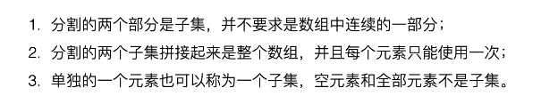
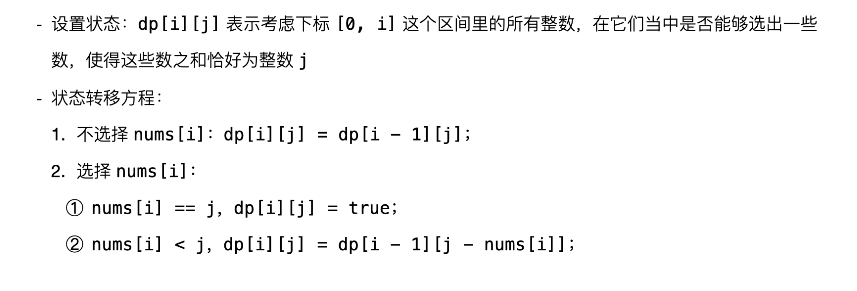
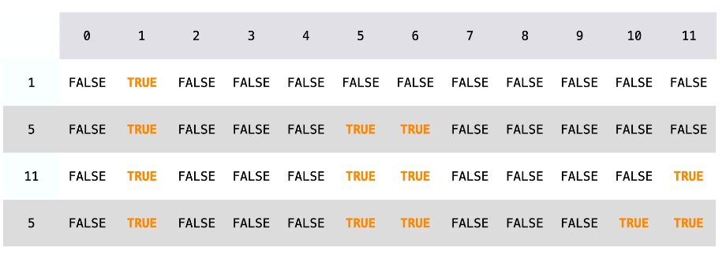
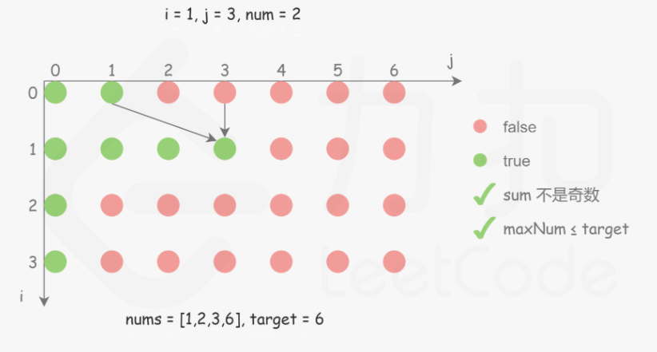

## 0-1 背包

[1085 背包问题（0-1背包模板题） - 0一叶0知秋0 - 博客园 (cnblogs.com)](https://www.cnblogs.com/yi-ye-zhi-qiu/p/7554736.html) 

[2. 01背包问题 - AcWing题库](https://www.acwing.com/problem/content/2/) 

有一个容量为 N 的背包，要用这个背包装下物品的价值最大，这些物品有两个属性：体积 w 和价值 v。

定义一个二维数组 dp 存储最大价值，其中 **dp\[i][j] 表示前 i 件物品体积不超过 j 的情况下能达到的最大价值**。

设第 i 件物品体积为 w，价值为 v，根据第 i 件物品是否添加到背包中，可以分两种情况讨论：

- 第 i 件物品没添加到背包，总体积不超过 j 的前 i 件物品的最大价值就是总体积不超过 j 的前 i-1 件物品的最大价值，dp\[i][j] = dp\[i-1][j]。
- 第 i 件物品添加到背包中，dp\[i][j] = dp\[i-1][j-w] + v。

第 i 件物品可添加也可以不添加，取决于哪种情况下最大价值更大。因此，0-1 背包的状态转移方程为：

<!--<div align="center"></div> <br>-->

<div align="center">  </div><br>
**0-1背包问题总结**：


```java
// N 为物品数量
// W 为背包总体积
// weights 数组存储 N 个物品的重量
// values  数组存储 N 个物品的价值
public int[][] knapsack(int W, int N, int[] weights, int[] values) {
    int[][] dp = new int[N + 1][W + 1];
    for (int i = 1; i <= N; i++) {				//允许的物品个数，在外边
        int w = weights[i - 1], v = values[i - 1];
        for (int j = 1; j <= W; j++) {			//允许的重量，在里面
            if (j >= w) { 						//能放进时，放与不放取最值
                dp[i][j] = Math.max(dp[i - 1][j], dp[i - 1][j - w] + v);
            } else {
                dp[i][j] = dp[i - 1][j];		//空间不够，放不进去，状态延续。
            }
        }
    }	 // dp[i-1][j-w]，前一个状态，移出去w空间后（状态价值）+价值后，和前一个状态取最值。
    return dp;
}
```

未优化核心代码

```java
dp[i][j] = dp[i - 1][j];
if (j >= w) dp[i][j] = Math.max(dp[i - 1][j], dp[i - 1][j - w] + v);
```

```java
public static void main(String[] args) {
     int[][] arr = knapsack(5, 4, new int[]{2, 1, 3, 2}, new int[]{3, 2, 4, 2});
     print(arr);//7
}
public static void print(int[][] arr) {
    for (int i = 0; i < arr.length; i++) {
        for (int j = 0; j < arr[0].length; j++) {
            System.out.print(arr[i][j] + " ");
        }
        System.out.println();
    }
}
```

执行图：


**空间优化**  

在程序实现时可以对 0-1 背包做优化。观察状态转移方程可以知道，前 i 件物品的状态仅与前 i-1 件物品的状态有关，因此可以将 dp 定义为一维数组，其中 dp[j] 既可以表示 dp\[i-1][j] 也可以表示 dp\[i][j]。此时，

<!--<div align="center"></div> <br>-->

<div align="center">  </div><br>
因为 dp[j-w] 表示 dp\[i-1][j-w]，因此不能先求 dp\[i][j-w]，防止将 dp\[i-1][j-w] 覆盖。

也就是说要先计算 dp\[i][j] 再计算 dp\[i][j-w]，在程序实现时需要按倒序来循环求解。

### 0-1 背包最终版

```java
public int knapsack(int W, int N, int[] weights, int[] values) {
    int[] dp = new int[W + 1];								//只保留列
    for (int i = 1; i <= N; i++) {
        int w = weights[i - 1], v = values[i - 1];
        for (int j = W; j >= w; j--) {						//反序遍历
            dp[j] = Math.max(dp[j], dp[j - w] + v);			//if判断缩到for循环里
        }
    }
    return dp[W];
}
```

**无法使用贪心算法的解释**  

0-1 背包问题无法使用贪心算法来求解，**也就是说不能按照先添加性价比最高的物品来达到最优**，这是因为这种方式可能造成**背包空间的浪费**，从而无法达到最优。考虑下面的物品和一个**容量为 5 的背包**，如果先添加物品 0 再添加物品 1，那么只能存放的价值为 16，浪费了大小为 2 的空间。最优的方式是存放物品 1 和物品 2，价值为 22.

| id   | w    | v    | v/w  |
| ---- | ---- | ---- | ---- |
| 0    | 1    | 6    | 6    |
| 1    | 2    | 10   | 5    |
| 2    | 3    | 12   | 4    |

### **背包变种**  

- **完全背包：物品数量为无限个**

- **多重背包：物品数量有限制**

- **多维费用背包**：物品不仅有重量，还有体积，同时考虑这两种**限制**

- 其它：**物品之间相互约束或者依赖**

### 1. 划分数组为和相等的两子集

416\. Partition Equal Subset Sum (Medium)

[Leetcode](https://leetcode.com/problems/partition-equal-subset-sum/description/) / [416. 分割等和子集](https://leetcode-cn.com/problems/partition-equal-subset-sum/)

```js
给定一个只包含正整数的非空数组。是否可以将这个数组分割成两个子集，使得两个子集的元素和相等。
#注意:每个数组中的元素不会超过 100、数组的大小不会超过 200

输入: [1, 5, 11, 5]
输出: true
解释: 数组可以分割成 [1, 5, 5] 和 [11].
 
输入: [1, 2, 3, 5]
输出: false
解释: 数组不能分割成两个元素和相等的子集.
```



可以看成一个背包大小为 sum/2 的 0-1 背包问题。


图解官方图解：

[动态规划（转换为 0-1 背包问题） - 分割等和子集 - 力扣（LeetCode） (leetcode-cn.com)](https://leetcode-cn.com/problems/partition-equal-subset-sum/solution/fen-ge-deng-he-zi-ji-by-leetcode-solution/) 

分析：



Demo过程：

1


2



3、



优化前

```java
//42ms,50%
class Solution {
    public boolean canPartition(int[] nums) {
        int len = nums.length;
        if (len < 2) return false;
        int sum = 0, maxNum = 0;
        for (int num : nums) {
            sum += num;
            maxNum = Math.max(maxNum, num);
        }
        if (sum % 2 != 0) return false;				//总和不是偶数不可以
        int w = sum / 2;							//w也可以理解为tar、sum
        if (maxNum > w) return false;				//最大的1个值比sum/2大不可以

        boolean[][] dp = new boolean[len][w + 1];
        //一、
        //for (int i = 0; i < len; i++) {				//第一列，边界处理
        //    dp[i][0] = true;
        //}
        //二、
        dp[0][nums[0]] = true;						//初始化第一行，其他的值都为默认false
        for (int i = 1; i < len; i++) {
            int num = nums[i];
            for (int j = 0; j <= w; j++) {			//三、
                if (j >= num) {
                    dp[i][j] = dp[i - 1][j] | dp[i - 1][j - num];
                } else {
                    dp[i][j] = dp[i - 1][j];
                }
            }
        }
        return dp[len - 1][w];
    }
}
//细节：初始化，用二、其实就可以了，
//三、的话，j可以从0开始，代表算出目标值是0的。 但是，j=1提交了没错。
```

优化后

```java
//22ms,88%
public boolean canPartition(int[] nums) {
    int sum = computeArraySum(nums);
    if (sum % 2 != 0) {	return false; }	   //nums元素总和必须为偶数才可以分
    int W = sum / 2;
    boolean[] dp = new boolean[W + 1];
    dp[0] = true;
    for (int num : nums) {                 //0-1 背包一个物品只能用一次
        for (int i = W; i >= num; i--) {   //从后往前，先计算 dp[i] 再计算 dp[i-num]
            dp[i] = dp[i] || dp[i - num];
        }
    }
    return dp[W];
}

private int computeArraySum(int[] nums) {
    int sum = 0;
    for (int num : nums) {
        sum += num;
    }
    return sum;
}
```

### 2. 改变正负号使得和为定数的方法

494\. Target Sum (Medium)

[Leetcode](https://leetcode.com/problems/target-sum/description/) / [494. 目标和](https://leetcode-cn.com/problems/target-sum/)

```js
给定一个非负整数数组，a1, a2, ..., an, 和一个目标数，S。现在你有两个符号 + 和 -。
对于数组中的任意一个整数，你都可以从 + 或 -中选择一个符号添加在前面。
返回可以使最终数组和为目标数 S 的所有添加符号的方法数。

示例：
输入：nums: [1, 1, 1, 1, 1], S: 3
输出：5
解释：
-1+1+1+1+1 = 3
+1-1+1+1+1 = 3
+1+1-1+1+1 = 3
+1+1+1-1+1 = 3
+1+1+1+1-1 = 3
一共有5种方法让最终目标和为3。

提示：
数组非空，且长度不会超过 20 。
初始的数组的和不会超过 1000 。
保证返回的最终结果能被 32 位整数存下。
```

该问题可以转换为 Subset Sum 问题，从而使用 0-1 背包的方法来求解。

[换一下角度，可以转换为典型的01背包问题 - 目标和 - 力扣（LeetCode） (leetcode-cn.com)](https://leetcode-cn.com/problems/target-sum/solution/huan-yi-xia-jiao-du-ke-yi-zhuan-huan-wei-dian-xing/) 

可以将这组数看成两部分，P 和 N，其中 P 使用正号，N 使用负号，有以下推导：

```js
                  sum(P) - sum(N) = target
sum(P) + sum(N) + sum(P) - sum(N) = target + sum(P) + sum(N)
                       2 * sum(P) = target + sum(nums)
```

因此只要找到一个子集，令它们都取正号，并且和等于 (target + sum(nums))/2，就证明存在解。

```java
//2ms,100%
public int findTargetSumWays(int[] nums, int S) {
    int sum = computeArraySum(nums);
    if (sum < S || (sum + S) % 2 == 1) return 0;	//奇数或者目标值太大
    int W = (sum + S) / 2;
    int[] dp = new int[W + 1];
    dp[0] = 1;
    for (int num : nums) {
        for (int i = W; i >= num; i--) {			//i >= num i从num开始，省略里面的判断
            dp[i] = dp[i] + dp[i - num];
        }
    }
    return dp[W];
}

private int computeArraySum(int[] nums) {
    int sum = 0;
    for (int num : nums) {
        sum += num;
    }
    return sum;
}
```

DFS 解法（枚举）：

```java
//652ms,18%
public int findTargetSumWays(int[] nums, int S) {
    return findTargetSumWays(nums, 0, S);
}

private int findTargetSumWays(int[] nums, int start, int S) {
    if (start == nums.length) {
        return S == 0 ? 1 : 0;
    }
    return findTargetSumWays(nums, start + 1, S + nums[start])
         + findTargetSumWays(nums, start + 1, S - nums[start]);
}
```

### 多维费用 - 多限制背包

### 3. 01 字符构成最多的字符串

474\. Ones and Zeroes (Medium)

[Leetcode](https://leetcode.com/problems/ones-and-zeroes/description/) / [474. 一和零](https://leetcode-cn.com/problems/ones-and-zeroes/)

```js
给你一个二进制字符串数组 strs 和两个整数 m 和 n 。
请你找出并返回 strs 的最大子集的大小，该子集中 #最多 有 m 个 0 和 n 个 1 。
如果 x 的所有元素也是 y 的元素，集合 x 是集合 y 的 子集 。
#题目转述：求最大子集

输入：strs = ["10", "0001", "111001", "1", "0"], m = 5, n = 3
输出：4
解释：最多有 5 个 0 和 3 个 1 的最大子集是 {"10","0001","1","0"} ，因此答案是 4 。
其他满足题意但较小的子集包括 {"0001","1"} 和 {"10","1","0"} 。{"111001"} 不满足题意，因为它含 4 个 1 ，大于 n 的值 3 。

输入：strs = ["10", "0", "1"], m = 1, n = 1
输出：2
解释：最大的子集是 {"0", "1"} ，所以答案是 2 。
```

这是一个多维费用的 0-1 背包问题，有两个背包大小，0 的数量和 1 的数量。

参考：[动态规划（转换为 0-1 背包问题） - 一和零 - 力扣（LeetCode） (leetcode-cn.com)](https://leetcode-cn.com/problems/ones-and-zeroes/solution/dong-tai-gui-hua-zhuan-huan-wei-0-1-bei-bao-wen-ti/) 

官解是优化后的： [一和零 - 一和零 - 力扣（LeetCode） (leetcode-cn.com)](https://leetcode-cn.com/problems/ones-and-zeroes/solution/yi-he-ling-by-leetcode/) 

思路：把总共的 0 和 1 的个数视为背包的容量，每一个字符串视为装进背包的物品。这道题就可以使用 0-1 背包问题的思路完成，这里的目标值是能放进背包的字符串的数量。

动态规划的思路是：物品一个一个尝试，容量一点一点尝试，每个物品分类讨论的标准是：选与不选。

定义状态：尝试题目问啥，就把啥定义成状态。dp\[i]\[j][k] 表示输入字符串在子区间 [0, i] 能够使用 j 个 0 和 k 个 1 的字符串的最大数量。

初始化：为了避免分类讨论，通常多设置一行。这里可以认为，第 0 个字符串是空串。第 0 行默认初始化为 0。
输出：输出是最后一个状态，即：dp\[len]\[m][n]。

方程：


```java
//74ms,27%
class Solution {
    public int findMaxForm(String[] strs, int m, int n) {
        int M = m + 1;
        int N = n + 1;
        // dp[插入/不插入第i个字符串][m个1][n个0] 组合最多的字符串数量
        int[][][] dp = new int[strs.length + 1][M][N];
        for (int k = 1; k < strs.length + 1; k++) {
            String str = strs[k - 1];
            int zeroCnt = getZeroCount(str);
            int oneCnt = str.length() - zeroCnt;
            for (int i = 0; i < M; i++) {
                for (int j = 0; j < N; j++) {
                    dp[k][i][j] = dp[k - 1][i][j];		 // 先把上一行抄下来
                    if (i >= zeroCnt && j >= oneCnt) {
                        dp[k][i][j] = Math.max(dp[k][i][j],
                         			  dp[k - 1][i - zeroCnt][j - oneCnt] + 1);
                    }
                    //dp[k][i][j] = Math.max(dp[k - 1][i][j], dp[k][i][j]);
                }
            }
        }
        return dp[strs.length][m][n];
    }
    public int getZeroCount(String s) {
        int zeros = 0;
        for (char c : s.toCharArray()) {
            if (c == '0') zeros++;
        }
        return zeros;
    }
}
```

空间优化后

```java
//空间优化后，33ms，82%
public int findMaxForm(String[] strs, int m, int n) {
    if (strs == null || strs.length == 0) return 0;
    int[][] dp = new int[m + 1][n + 1];
    for (String s : strs) {    					// 每个字符串只能用一次
        int ones = 0, zeros = 0;
        for (char c : s.toCharArray()) {
            if (c == '0') zeros++;
            else ones++;
        }
        for (int i = m; i >= zeros; i--) {		//优化后，倒着的
            for (int j = n; j >= ones; j--) {	//优化后，倒着的
                dp[i][j] = Math.max(dp[i][j], dp[i - zeros][j - ones] + 1);
            }
        }
    }
    return dp[m][n];
}
```

