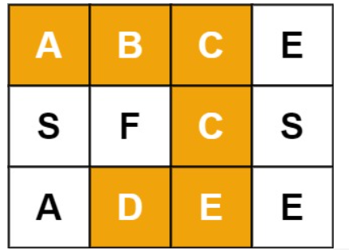

## Backtracking

Backtracking（回溯）属于 DFS。

- 普通 DFS 主要用在   **可达性问题**  ，这种问题只需要执行到特点的位置然后返回即可。
- 而 Backtracking 主要用于求解   **排列组合**   问题，例如有 { 'a','b','c' } 三个字符，求解所有由这三个字符排列得到的字符串，这种问题在执行到特定的位置返回之后还会继续执行求解过程。

因为 Backtracking 不是立即返回，而要继续求解，因此在程序实现时，需要注意对元素的标记问题：

- 在访问一个新元素进入新的递归调用时，需要将新元素标记为已经访问，这样才能在继续递归调用时不用重复访问该元素；
- 但是在递归返回时，需要将元素标记为未访问，因为只需要保证在一个递归链中不同时访问一个元素，可以访问已经访问过但是不在当前递归链中的元素。

### 1. 数字键盘组合

中等：[17. 电话号码的字母组合](https://leetcode-cn.com/problems/letter-combinations-of-a-phone-number/)

<div align="center">  </div><br>
```js
给定一个仅包含数字 2-9 的字符串，返回所有它能表示的字母组合。答案可以按 任意顺序 返回。
给出数字到字母的映射如下（与电话按键相同）。注意 1 不对应任何字母。

示例 1：
输入：digits = "23"
输出：["ad","ae","af","bd","be","bf","cd","ce","cf"]

示例 2：
输入：digits = ""
输出：[]

示例 3：
输入：digits = "2"
输出：["a","b","c"]

提示：
0 <= digits.length <= 4
digits[i] 是范围 ['2', '9'] 的一个数字。
```


字符串不用回溯拼接

```java
class Solution {
    private String mp[] = {" ", "", //0、1，这个位置都无所谓的
     "abc", "def", "ghi", "jkl", "mno", "pqrs", "tuv", "wxyz"};
    private ArrayList<String> res;

    public List<String> letterCombinations(String digits) {
        res = new ArrayList<String>();
        if (digits.equals("")) return res;
        findCombination(digits, 0, "");
        return res;
    }

    private void findCombination(String digits, int idx, String s) {
        if (idx == digits.length()) {
            res.add(s);
            return;
        }
        Character numC = digits.charAt(idx);
        String abc = mp[numC - '0'];
        for (int i = 0; i < abc.length(); i++) {
            String cur = s + abc.charAt(i);
            findCombination(digits, idx + 1, cur);
        }
        return;
    }
}
```

StringBuilder 需要回溯删除

```java
class Solution {
    int len;
    String[] map = new String[]{"abc", "def", "ghi", "jkl", "mno", "pqrs", "tuv", "wxyz"};
    List<String> ans = new ArrayList<>();

    public List<String> letterCombinations(String digits) {
        if ("".equals(digits)) return ans;
        len = digits.length();
        dfs(new StringBuilder(), digits, 0);
        return ans;
    }

    public void dfs(StringBuilder sb, String digits, int idx) {
        if (sb.length() == len) {
            ans.add(sb.toString());
            return;
        }
        char numC = digits.charAt(idx);
        String abc = map[numC - '2'];
        for (int j = 0; j < abc.length(); j++) {
            sb.append(abc.charAt(j));
            dfs(sb, digits, idx + 1);
            sb.deleteCharAt(sb.length() - 1);
        }
    }
}
```

DFS - 队列

```java
class Solution {
    public List<String> letterCombinations(String digits) {
        LinkedList<String> ans = new LinkedList<String>();
        if(digits.isEmpty()) return ans;
        String[] mp = new String[] {"0", "1", "abc", "def", "ghi", "jkl", "mno", "pqrs", "tuv", "wxyz"};
        ans.add("");
        for(int i =0; i<digits.length();i++){
            int x = Character.getNumericValue(digits.charAt(i));
            while(ans.peek().length()==i){
                String cache = ans.remove();
                for(char c : mp[x].toCharArray())
                    ans.add(cache+c);
            }
        }
        return ans;
    }
}
```

### 2. IP 地址划分

中等：[93. 复原 IP 地址](https://leetcode-cn.com/problems/restore-ip-addresses/)

```js
给定一个只包含数字的字符串，用以表示一个 IP 地址，返回所有可能从 s 获得的 有效 IP 地址 。
可以按任何顺序返回答案。
有效 IP 地址 正好由四个整数（每个整数位于 0 到 255 之间组成，且不能含有前导 0），整数之间用 '.' 分隔。
例如："0.1.2.201" 和 "192.168.1.1" 是 有效 IP 地址，但是 "0.011.255.245"、"192.168.1.312" 和 "192.168@1.1" 是 无效 IP 地址。

示例 1：

输入：s = "25525511135"
输出：["255.255.11.135","255.255.111.35"]
示例 2：

输入：s = "0000"
输出：["0.0.0.0"]
示例 3：

输入：s = "1111"
输出：["1.1.1.1"]
示例 4：

输入：s = "010010"
输出：["0.10.0.10","0.100.1.0"]
示例 5：

输入：s = "101023"
输出：["1.0.10.23","1.0.102.3","10.1.0.23","10.10.2.3","101.0.2.3"]

提示：0 <= s.length <= 3000，s 仅由数字组成
```

详细解释版本，6ms，35%

```js
标准回溯,模板
dfs(){
    // 符合条件加入
    if() 
    // 排除不符合条件的情况,停止搜索
    if()
    //做出选择
    for(){
        // 操作数据
        ....

        dfs();//继续搜素

        // 还原数据
        ....
    }
}

dfs(String s,int start,int end,StringBuilder sb,int time)
dfs功能: 截取[start,end) 加入sb, 当截取次数time到4次,且start遍历到尾部时,加入结果集result

作者：jobyterry
链接：https://leetcode-cn.com/problems/restore-ip-addresses/solution/java-biao-zhun-hui-su-fei-chang-rong-yi-6hg9v/
```

```java
class Solution {
    List<String> ret;

    public List<String> restoreIpAddresses(String str) {
        ret = new LinkedList<String>();
        if (str.length() > 12) return ret;//IP地址总长度超了,无法转换返回
        dfs(str, 0, 1, new StringBuilder(), 0);//从截取长度为1开始
        dfs(str, 0, 2, new StringBuilder(), 0);//从截取长度为2开始
        dfs(str, 0, 3, new StringBuilder(), 0);//从截取长度为3开始
        return ret;
    }

    void dfs(String str, int l, int r, StringBuilder sb, int time) {
        // 截取四次,且遍历到尾部,r==l+1防止重复
        if (time == 4 && l == str.length() && r == l + 1) {
            ret.add(sb.toString());
            return;
        }
        if (r > str.length()) return;// 无法截取[l,r) end超了
        if (r - l <= 0 || r - l > 3) return;//无法截取[l,r),每段的长度不能为0,不能大于3
        if (r - l > 1 && str.charAt(l) == '0') return;//当截取长度不是1(若长度为1允许为0),其他情况出现首零,返回
        if (Integer.parseInt(str.substring(l, r)) > 255) return;//大于255,返回

        for (int i = 1; i <= 3; i++) {// 截取 长度 1,2,3 三种情况
            sb.append(str.substring(l, r));//加入
            if (time <= 2) sb.append('.');

            dfs(str, r, r + i, sb, time + 1);//继续裁剪

            if (time <= 2) sb.deleteCharAt(sb.length() - 1);//还原数据的操作
            sb.delete(sb.length() - (r - l), sb.length());
        }
    }
}
```

6ms，35%

```java
class Solution {
    public List<String> restoreIpAddresses(String str) {
        List<String> ret = new ArrayList<>();
        StringBuilder sb = new StringBuilder();
        doRestore(0, sb, ret, str);
        return ret;
    }
    // sb:tempAddress
    // ret:addresses
    private void doRestore(int idx, StringBuilder sb, List<String> ret, String str) {
        if (idx == 4 || str.length() == 0) {
            if (idx == 4 && str.length() == 0) {
                ret.add(sb.toString());
            }
            return;
        }
        for (int i = 0; i < str.length() && i <= 2; i++) {
            if (i != 0 && str.charAt(0) == '0') {
                break;
            }
            String part = str.substring(0, i + 1);
            if (Integer.valueOf(part) <= 255) {
                if (sb.length() != 0) {
                    part = "." + part;
                }
                sb.append(part);
                doRestore(idx + 1, sb, ret, str.substring(i + 1));
                sb.delete(sb.length() - part.length(), sb.length());
            }
        }
    }
}
```

上边的改进版本，2ms，80%

```java
public class Solution {

    public List<String> restoreIpAddresses(String s) {
        int len = s.length();
        List<String> res = new ArrayList<>();
        if (len > 12 || len < 4) {
            return res;
        }
        Deque<String> path = new ArrayDeque<>(4);
        dfs(s, len, 0, 4, path, res);
        return res;
    }

    // residue,需要一个变量记录剩余多少段还没被分割
    private void dfs(String s, int len, int begin, int residue, Deque<String> path, List<String> res) {
        if (begin == len) {
            if (residue == 0) {
                res.add(String.join(".", path));
            }
            return;
        }

        for (int i = begin; i < begin + 3; i++) {
            if (i >= len) {
                break;
            }

            if (residue * 3 < len - i) {
                continue;
            }

            if (judgeIpSegment(s, begin, i)) {
                String currentIpSegment = s.substring(begin, i + 1);
                path.addLast(currentIpSegment);

                dfs(s, len, i + 1, residue - 1, path, res);
                path.removeLast();
            }
        }
    }

    private boolean judgeIpSegment(String s, int left, int right) {
        int len = right - left + 1;
        if (len > 1 && s.charAt(left) == '0') {
            return false;
        }

        int res = 0;
        while (left <= right) {
            res = res * 10 + s.charAt(left) - '0';
            left++;
        }

        return res >= 0 && res <= 255;
    }
}
```

```java
//上边版本的方法解释：
//String.join()
//public static String join(CharSequence delimiter,CharSequence... elements)

//demo1                     
public class Example{  
   public static void main(String args[]){  
    //The first argument to this method is the delimiter
    String str=String.join("^","You","are","Awesome");  
    System.out.println(str);  
   }
}
//You^are^Awesome

//demo1     
public class Example{  
   public static void main(String args[]){  
    //Converting an array of String to the list
    List list<String> = Arrays.asList("Steve", "Rick", "Peter", "Abbey");
    String names = String.join(" | ", list);
    System.out.println(names);
   }
}
//Steve | Rick | Peter | Abbey
```

官解，1ms，99%

```java
class Solution {
    static final int SEG_COUNT = 4;
    List<String> ans = new ArrayList<String>();
    int[] segments = new int[SEG_COUNT];

    public List<String> restoreIpAddresses(String s) {
        segments = new int[SEG_COUNT];
        dfs(s, 0, 0);
        return ans;
    }

    public void dfs(String s, int segId, int segStart) {
        // 如果找到了 4 段 IP 地址并且遍历完了字符串，那么就是一种答案
        if (segId == SEG_COUNT) {
            if (segStart == s.length()) {
                StringBuffer ipAddr = new StringBuffer();
                for (int i = 0; i < SEG_COUNT; ++i) {
                    ipAddr.append(segments[i]);
                    if (i != SEG_COUNT - 1) {
                        ipAddr.append('.');
                    }
                }
                ans.add(ipAddr.toString());
            }
            return;
        }

        // 如果还没有找到 4 段 IP 地址就已经遍历完了字符串，那么提前回溯
        if (segStart == s.length()) {
            return;
        }

        // 由于不能有前导零，如果当前数字为 0，那么这一段 IP 地址只能为 0
        if (s.charAt(segStart) == '0') {
            segments[segId] = 0;
            dfs(s, segId + 1, segStart + 1);
        }

        // 一般情况，枚举每一种可能性并递归
        int addr = 0;
        for (int segEnd = segStart; segEnd < s.length(); ++segEnd) {
            addr = addr * 10 + (s.charAt(segEnd) - '0');
            if (addr > 0 && addr <= 0xFF) {
                segments[segId] = addr;
                dfs(s, segId + 1, segEnd + 1);
            } else {
                break;
            }
        }
    }
}
```


其他，3ms，60%

```java
import java.util.ArrayList;
import java.util.List;

class Solution {
    public List<String> restoreIpAddresses(String s) {
        List<String> ret = new ArrayList<>();
        StringBuilder sb = new StringBuilder();
        doRestore(0, sb, ret, s);
        return ret;
    }
    // sb:tempAddress
    // ret:addresses
    private void doRestore(int k, StringBuilder sb, List<String> ret, String s) {
        if (k == 4 || s.length() == 0) {
            if (k == 4 && s.length() == 0) {
                ret.add(sb.toString());
            }
            return;
        }
        for (int i = 0; i < s.length() && i <= 2; i++) {
            if (i != 0 && s.charAt(0) == '0') {
                break;
            }
            String part = s.substring(0, i + 1);
            if (Integer.valueOf(part) <= 255) {
                if (sb.length() != 0) {
                    part = "." + part;
                }
                sb.append(part);
                doRestore(k + 1, sb, ret, s.substring(i + 1));
                sb.delete(sb.length() - part.length(), sb.length());
            }
        }
    }
}
```

### 3. 在矩阵中寻找字符串

中等：[79. 单词搜索](https://leetcode-cn.com/problems/word-search/)

```js
给定一个 m x n 二维字符网格 board 和一个字符串单词 word 。
如果 word 存在于网格中，返回 true ；否则，返回 false 。
单词必须按照字母顺序，通过相邻的单元格内的字母构成，其中“相邻”单元格是那些#水平相邻或垂直相邻的单元格。
同一个单元格内的字母不允许被重复使用。

提示：
m == board.length
n = board[i].length
1 <= m, n <= 6
1 <= word.length <= 15
board 和 word 仅由大小写英文字母组成
```

```js
示例 1：
输入：board = [["A","B","C","E"],["S","F","C","S"],["A","D","E","E"]], word = "ABCCED"
输出：true
```



```js
示例 2：
输入：board = [["A","B","C","E"],["S","F","C","S"],["A","D","E","E"]], word = "SEE"
输出：true
```


```js
示例 3：
输入：boar
d = [["A","B","C","E"],["S","F","C","S"],["A","D","E","E"]], word = "ABCB"
输出：false
```


就是搜索的模板题目，没啥难度，其他类似的题目。

[「力扣」第 130 题：被围绕的区域](https://leetcode-cn.com/problems/surrounded-regions/)

[「力扣」第 200 题：岛屿数量](https://leetcode-cn.com/problems/number-of-islands/) 

```java
//68ms,50%
class Solution {
    public boolean exist(char[][] board, String word) {
        for (int i = 0; i < board.length; i++) {
            for (int j = 0; j < board[0].length ; j++) {
                if (dfs(board, i, j, word, 0)) {
                    return true;
                }
            }
        }
        return false;
    }

    private boolean dfs(char[][] board, int i, int j, String word, int idx) {
        if (idx == word.length()) {
            return true;
        }
        if (i < 0 || i >= board.length || j < 0 || j >= board[0].length
         || board[i][j] != word.charAt(idx)) {
            return false;
        }
        char tem = board[i][j];					//临时变量缓存，省去一个布尔数组。
        board[i][j] = '*'; 						//此处覆盖避免来回使用该字母
        boolean ret = dfs(board, i, j + 1, word, idx + 1)
         || dfs(board, i, j - 1, word, idx + 1)
         || dfs(board, i + 1, j, word, idx + 1)
         || dfs(board, i - 1, j, word, idx + 1);
        board[i][j] = tem; //还原
        return ret;
    }
}
```

### 4. 输出二叉树中所有从根到叶子的路径

中等：[257. 二叉树的所有路径](https://leetcode-cn.com/problems/binary-tree-paths/)

```html
  1
 /  \
2    3
 \
  5
```

```html
[输入，输出]：["1->2->5", "1->3"]
```

图解：


```java
//2ms,80%
class Solution {
    List<String> paths = new LinkedList<>();
    public List<String> binaryTreePaths(TreeNode root) {
        findPaths(root, "");
        return paths;
    }

    public void findPaths(TreeNode root, String path) {
        if (root == null) return;						// 遇到空树返回
        path += String.valueOf(root.val);				// 否则节点加入路径
        if (root.left == null && root.right == null)    // 叶子节点，路径已完整
            paths.add(path);							//下边的else去掉了。
        path += "->";
        findPaths(root.left, path);						//用的是String拼接，而sb的话要回溯。
        findPaths(root.right, path);
    }
}
```

```java
// StringBuilder 版本，速度没快什么。
class Solution {
    private List<String> res = new ArrayList<>();
    public List<String> binaryTreePaths(TreeNode root) {
        dfs(root, new StringBuilder());
        return res;
    }
    private void dfs(TreeNode root, StringBuilder sb) {
        if (root == null) return;
        sb.append(root.val);
        if (root.left == null && root.right == null) {
            res.add(sb.toString());
            return;
        }
        if (root.left != null) dfs(root.left, new StringBuilder(sb).append("->"));
        if (root.right != null) dfs(root.right, new StringBuilder(sb).append("->"));
    }
}
// StringBuilder 略微不同。
class Solution {
    public List<String> binaryTreePaths(TreeNode root) {
        List<String> paths = new ArrayList<>();
        findPaths(root, "", paths);
        return paths;
    }

    public void findPaths(TreeNode root, String path, List<String> paths) {
        if (root == null) return;
        StringBuffer sb = new StringBuffer(path);
        sb.append(Integer.toString(root.val));
        if (root.left == null && root.right == null) 
            paths.add(sb.toString());  
        sb.append("->");  
        findPaths(root.left, sb.toString(), paths);
        findPaths(root.right, sb.toString(), paths);

    }
}
```

### 5. 排列

中等：[46. 全排列](https://leetcode-cn.com/problems/permutations/)

```html
[1,2,3] have the following permutations:
[
  [1,2,3],
  [1,3,2],
  [2,1,3],
  [2,3,1],
  [3,1,2],
  [3,2,1]
]
注意，不包含重复元素。
```

```java
//1ms、96%
class Solution {
    int[] nums;
    boolean[] book;
    List<List<Integer>> rets = new ArrayList<>();

    public List<List<Integer>> permute(int[] nums) {
        this.nums = nums;
        this.book = new boolean[nums.length];
        backtracking(new ArrayList<>());
        return rets;
    }

    private void backtracking(List<Integer> ret) {
        if (ret.size() == nums.length) {			// 不能是nums.length-1，否则会少一位。
            rets.add(new ArrayList<>(ret));         // 重新构造一个 List
            return;
        }
        for (int i = 0; i < book.length; i++) {
            if (book[i]) continue;
            book[i] = true;           			    // 这里book不晓得怎么用临时变量省去
            ret.add(nums[i]);
            backtracking(ret);
            ret.remove(ret.size() - 1);
            book[i] = false;
        }
    }
}
```

```java
//官解,1ms
//时间、空间：双O(N*N!)
class Solution {
    int len;
    List<List<Integer>> rets = new ArrayList<List<Integer>>();

    public List<List<Integer>> permute(int[] nums) {
        this.len = nums.length;
        ArrayList ret = new ArrayList<Integer>();
        for (int num : nums) {
            ret.add(num);//或者这一步换成操作原数组，弄个int[][]的结果再转List<List<Integer>>
        }
        backtrack(ret, 0);
        return rets;
    }
    void backtrack(List<Integer> ret, int dep) {				 // dep不能动，不能省。
        if (dep == len) rets.add(new ArrayList<Integer>(ret));   // 所有数都填完了
        for (int i = dep; i < len; i++) {
            Collections.swap(ret, dep, i);                       // 动态维护数组
            backtrack(ret, dep + 1);                             // 继续递归填下一个数
            Collections.swap(ret, dep, i);                       // 撤销操作
        }
    }
}

```

优秀详细解（未细看）：https://leetcode-cn.com/problems/permutations/solution/hui-su-suan-fa-python-dai-ma-java-dai-ma-by-liweiw/


```java
//1ms，不回溯写法。
public class Solution {
    int len;
    int[] nums;
    List<List<Integer>> rets = new ArrayList<>();
    public List<List<Integer>> permute(int[] nums) {
        this.len = nums.length;
        this.nums = nums;
        
        if (len == 0) return rets;				// 这行判断必须在this赋值后边
        dfs(new ArrayList<>(),new boolean[len]);
        return rets;
    }

    void dfs(List<Integer> ret,boolean[] book) {
        if (ret.size() == len) {				// 递归深度和len相等
            rets.add(ret);
            return;
        }
        // 3、不用拷贝，因为每一层传递下来的 ret 变量都是新建的
        for (int i = 0; i < len; i++) {
            if (book[i]) continue;
            // 1、每一次尝试都创建新的变量表示当前的"状态"
            List<Integer> curRet = new ArrayList<>(ret);
            curRet.add(nums[i]);

            boolean[] curBook = new boolean[len];
            System.arraycopy(book, 0, curBook, 0, len);
            curBook[i] = true;

            dfs( curRet, curBook);
            // 2、无需回溯
        }
    }
}
```

### 6. 含有相同元素求排列

中等：[47. 全排列 II](https://leetcode-cn.com/problems/permutations-ii/)

```js
给定一个可包含重复数字的序列 nums ，按任意顺序 返回所有不重复的全排列。

示例 1：

输入：nums = [1,1,2]
输出：
[[1,1,2],
 [1,2,1],
 [2,1,1]]

示例 2：

输入：nums = [1,2,3]
输出：[[1,2,3],[1,3,2],[2,1,3],[2,3,1],[3,1,2],[3,2,1]]

提示：
1 <= nums.length <= 8、-10 <= nums[i] <= 10、包含重复元素
```

**数组元素可能含有相同的元素**，进行排列时就有可能出现重复的排列，要求重复的排列只返回一个。

在实现上，和 Permutations 不同的是要**先排序**，然后在添加一个元素时，判断这个元素是否等于前一个元素，如果等于，并且前一个元素还未访问，那么就跳过这个元素。

```java
//1ms，代码同样适用于 46.全排列
class Solution {
    int[] nums;
    boolean[] book;
    List<List<Integer>> rets = new ArrayList<>();
    public List<List<Integer>> permuteUnique(int[] nums) {
        this.nums = nums;
        this.book = new boolean[nums.length];
        Arrays.sort(nums);  // 排序
        backtracking(new ArrayList<>() );
        return rets;
    }

    private void backtracking(List<Integer> ret) {
        if (ret.size() == nums.length) {
            rets.add(new ArrayList<>(ret));
            return;
        }
        for (int i = 0; i < book.length; i++) {
            if (book[i]) continue;
            if (i != 0 && nums[i] == nums[i - 1] && !book[i - 1]) 
                continue;  // 防止重复
            book[i] = true;
            ret.add(nums[i]);
            backtracking(ret);
            ret.remove(ret.size() - 1);
            book[i] = false;
        }
    }
}
```

类似题目关联拓展：牛客剑指（包含重复字符的全排列），[字符串的排列](https://www.nowcoder.com/jump/super-jump/word?word=字符串的排列)

```java
import java.util.ArrayList;
import java.util.Arrays;

//输入：a,b,c
//输出：abc,acb,bac,bca,cab和cba。
public class Solution {
    char[] cs;
    private ArrayList<String> ret = new ArrayList<>();

    public ArrayList<String> Permutation(String str) {
        if (str.length() == 0) return ret;
        this.cs = str.toCharArray();
        Arrays.sort(cs);           		// 注意排序
        backtracking(new boolean[cs.length], new StringBuilder());
        return ret;
    }

    private void backtracking(boolean[] book, StringBuilder sb) {
        if (sb.length() == cs.length) {
            ret.add(sb.toString());
            return;
        }
        for (int i = 0; i < cs.length; i++) {
            if (book[i]) continue;
            if (i != 0 && cs[i] == cs[i - 1] && !book[i - 1]) // 保证不重复
                continue;
            book[i] = true;
            sb.append(cs[i]);
            backtracking(book, sb);        //直接传 sb
            sb.deleteCharAt(sb.length() - 1);
            book[i] = false;
        }
    }
}
```

### 7. 组合

中等：[77. 组合](https://leetcode-cn.com/problems/combinations/)

```html
给定两个整数 n 和 k，返回 1 ... n 中所有可能的 k 个数的组合。

示例:
输入: n = 4, k = 2
输出:
[
  [2,4],
  [3,4],
  [2,3],
  [1,2],
  [1,3],
  [1,4],
]
```

未剪枝版本

详细图解参考：https://leetcode-cn.com/problems/combinations/solution/hui-su-suan-fa-jian-zhi-python-dai-ma-java-dai-ma-/

```java
//20ms,50%
public class Solution {
    public List<List<Integer>> combine(int n, int k) {
        List<List<Integer>> rets = new ArrayList<>();
        if (k <= 0 || n < k) return rets;		//可无
        Deque<Integer> ret = new ArrayDeque<>();//这里方法回溯使用，也可以是ArrayList
        dfs(n, k, 1, ret, rets);				// 从 1 开始是题目的设定
        return rets;
    }

    void dfs(int n, int k, int begin, Deque<Integer> ret, List<List<Integer>> rets) {
        if (ret.size() == k) {					//ret 的长度等于 k
            rets.add(new ArrayList<>(ret));
            return;
        }
        for (int i = begin; i <= n; i++) {		// 遍历可能的搜索起点
            ret.addLast(i);
            dfs(n, k, i + 1, ret, rets);		//组合数不允许出现重复的元素
            ret.removeLast();
        }
    }
}
```

剪枝，非以上版本的剪枝

```java
//1ms,100%
class Solution {
    List<List<Integer>> rets = new ArrayList<>();
    List<Integer> ret = new ArrayList<>();
    public List<List<Integer>> combine(int n, int k) {
        backtracking(1, k, n);
        return rets;
    }

    private void backtracking(int dep, int k, int n) {
        if (k == 0) {
            rets.add(new ArrayList<>(ret));
            return;
        }
        for (int i = dep; i <= n - k + 1; i++) {  // 剪枝
            ret.add(i);
            backtracking(i + 1, k - 1, n);
            ret.remove(ret.size() - 1);
        }
    }
}
```

### 8. 组合求和

中等：[39. 组合总和](https://leetcode-cn.com/problems/combination-sum/)

```js
给定一个无重复元素的数组 candidates 和一个目标数 target ，找出 candidates 中所有可以使数字和为 target 的组合。

说明：#candidates 中的数字可以无限制重复被选取。candidate 中的每个元素都是独一无二的。
所有数字（包括 target）都是正整数。解集不能包含重复的组合。 

示例 1：

输入：candidates = [2,3,6,7], target = 7,
所求解集为：
[
  [7],
  [2,2,3]
]
示例 2：

输入：candidates = [2,3,5], target = 8,
所求解集为：
[
  [2,2,2,2],
  [2,3,3],
  [3,5]
]

提示：
1 <= target <= 500
1 <= candidates.length <= 30
1 <= candidates[i] <= 200
```

```java
class Solution {
    public List<List<Integer>> combinationSum(int[] candidates, int tar) {
        List<List<Integer>> rets = new ArrayList<>();
        backtracking(new ArrayList<>(), rets, 0, tar, candidates);
        return rets;
    }

    void backtracking(List<Integer> ret, List<List<Integer>> rets,
                              int start, int tar, int[] nums) {
        if (tar == 0) {
            rets.add(new ArrayList<>(ret));
            return;
        }
        for (int i = start; i < nums.length; i++) {
            if (nums[i] > tar) continue;
            ret.add(nums[i]);
            backtracking(ret, rets, i, tar - nums[i], nums);
            ret.remove(ret.size() - 1);
        }
    }
}
```

### 9. 含有相同元素的组合求和

中等：[40. 组合总和 II](https://leetcode-cn.com/problems/combination-sum-ii/)

```js
给定一个数组 candidates 和一个目标数 target ，找出 candidates 中所有可以使数字和为 target 的组合。

说明：#candidates 中的每个数字在每个组合中只能使用一次。candidates数字存在重复。
所有数字（包括目标数）都是正整数。解集不能包含重复的组合。

示例 1:

输入: candidates = [10,1,2,7,6,1,5], target = 8,
所求解集为:
[
  [1, 7],
  [1, 2, 5],
  [2, 6],
  [1, 1, 6]
]
示例 2:

输入: candidates = [2,5,2,1,2], target = 5,
所求解集为:
[
  [1,2,2],
  [5]
]
```

```java
class Solution {
    public List<List<Integer>> combinationSum2(int[] nums, int tar) {
        List<List<Integer>> rets = new ArrayList<>();
        Arrays.sort(nums);						//排序
        backtracking(new ArrayList<>(), rets, new boolean[nums.length], 0, tar, nums);
        return rets;
    }

    void backtracking(List<Integer> ret, List<List<Integer>> rets,
                      boolean[] book, int start, int tar, int[] nums) {
        if (tar == 0) {
            rets.add(new ArrayList<>(ret));
            return;
        }
        for (int i = start; i < nums.length; i++) {
            if (i != 0 && nums[i] == nums[i - 1] && !book[i - 1]) 
                continue;						//重复跳过
            if (nums[i] > tar) continue;
            ret.add(nums[i]);
            book[i] = true;						//多了book
            backtracking(ret, rets, book, i + 1, tar - nums[i], nums);
            book[i] = false;
            ret.remove(ret.size() - 1);
        }
    }
}
```

### 10. 1-9 数字的组合求和

中等：[216. 组合总和 III](https://leetcode-cn.com/problems/combination-sum-iii/)

```js
找出所有相加之和为 n 的 k 个数的组合。组合中只允许含有 1 - 9 的正整数，并且每种组合中不存在重复的数字。
说明：所有数字都是正整数。解集不能包含重复的组合。 

示例 1:

输入: k = 3, n = 7
输出: [[1,2,4]]
示例 2:

输入: k = 3, n = 9
输出: [[1,2,6], [1,3,5], [2,3,4]]
```

题目表述：从 1-9 数字中选出 k 个数不重复的数，使得它们的和为 n。

```java
class Solution {
    public List<List<Integer>> combinationSum3(int k, int n) {
        List<List<Integer>> rets = new ArrayList<>();
        backtracking(k, n, 1,  new ArrayList<>(), rets);
        return rets;
    }
    private void backtracking(int k, int n, int start,
                              List<Integer> ret, List<List<Integer>> rets) {
        if (k == 0 && n == 0) {
            rets.add(new ArrayList<>(ret));
            return;
        }
        if (k == 0 || n == 0) return;
        for (int i = start; i <= 9; i++) {				//1-9
            ret.add(i);
            backtracking(k - 1, n - i, i + 1, ret, rets);
            ret.remove(ret.size() - 1);
        }
    }
}
```

### 11. 子集

中等：[78. 子集](https://leetcode-cn.com/problems/subsets/)

```js
给你一个整数数组 nums ，#数组中的元素 互不相同 。
解集 不能 包含重复的子集。返回该数组所有可能的子集（幂集）。你可以按 任意顺序 返回解集。

示例 1：

输入：nums = [1,2,3]
输出：[[],[1],[2],[1,2],[3],[1,3],[2,3],[1,2,3]]
示例 2：

输入：nums = [0]
输出：[[],[0]]

提示：
1 <= nums.length <= 10
-10 <= nums[i] <= 10
```

题目表述：找出集合的所有子集，子集不能重复，[1, 2] 和 [2, 1] 这种子集算重复

```java
//1ms,82%
class Solution {
    public List<List<Integer>> rets(int[] nums) {
        List<List<Integer>> rets = new ArrayList<>();
        List<Integer> ret = new ArrayList<>();
        for (int size = 0; size <= nums.length; size++) {	// 不同的子集大小
            backtracking(0, ret, rets, size, nums); 
        }
        return rets;
    }

    void backtracking(int start, List<Integer> ret, List<List<Integer>> rets,
                              final int size, final int[] nums) {
        if (ret.size() == size) {
            rets.add(new ArrayList<>(ret));
            return;
        }
        for (int i = start; i < nums.length; i++) {
            ret.add(nums[i]);
            backtracking(i + 1, ret, rets, size, nums);
            ret.remove(ret.size() - 1);
        }
    }
}
```

### 12. 含有相同元素求子集

中等：[90. 子集 II](https://leetcode-cn.com/problems/subsets-ii/)

```js
给你一个整数数组 nums ，#其中可能包含重复元素
解集 不能 包含重复的子集。请你返回该数组所有可能的子集（幂集）,返回的解集中，子集可以按 任意顺序 排列。

示例 1：

输入：nums = [1,2,2]
输出：[[],[1],[1,2],[1,2,2],[2],[2,2]]
示例 2：

输入：nums = [0]
输出：[[],[0]]

提示：
1 <= nums.length <= 10
-10 <= nums[i] <= 10
```

```java
//1ms,99%
class Solution {
    public List<List<Integer>> subsetsWithDup(int[] nums) {
        Arrays.sort(nums);//排序
        List<List<Integer>> rets = new ArrayList<>();
        List<Integer> ret = new ArrayList<>();
        boolean[] book = new boolean[nums.length];
        for (int size = 0; size <= nums.length; size++) {
            backtracking(0, ret, rets, book, size, nums);
        }
        return rets;
    }

    void backtracking(int start, List<Integer> ret, List<List<Integer>> rets, 
                      boolean[] book, final int size, final int[] nums) {
        if (ret.size() == size) {
            rets.add(new ArrayList<>(ret));
            return;
        }
        for (int i = start; i < nums.length; i++) {
            if (i != 0 && nums[i] == nums[i - 1] && !book[i - 1])
                continue;//去重
            ret.add(nums[i]);
            book[i] = true;//添加book
            backtracking(i + 1, ret, rets, book, size, nums);
            book[i] = false;
            ret.remove(ret.size() - 1);
        }
    }
}
```

### 13. 分割字符串使得每个部分都是回文数

中等：[131. 分割回文串](https://leetcode-cn.com/problems/palindrome-partitioning/)

```js
给你一个字符串 s，请你将 s 分割成一些子串，使每个子串都是 回文串 。返回 s 所有可能的#分割方案。
回文串 是正着读和反着读都一样的字符串。

示例 1：

输入：s = "aab"
输出：[["a","a","b"],["aa","b"]]
示例 2：

输入：s = "a"
输出：[["a"]]

提示：
1 <= s.length <= 16
s 仅由小写英文字母组成
```

```java
//12ms,40% 少2ms可以到70%
class Solution {
    public List<List<String>> partition(String str) {
        List<List<String>> rets = new ArrayList<>();
        List<String> ret = new ArrayList<>();
        doPartition(str, rets, ret);
        return rets;
    }

    void doPartition(String str, List<List<String>> rets, List<String> ret) {
        if (str.length() == 0) {
            rets.add(new ArrayList<>(ret));
            return;
        }
        for (int i = 0; i < str.length(); i++) {
            if (!isPalindrome(str, 0, i)) continue;
            ret.add(str.substring(0, i + 1));
            doPartition(str.substring(i + 1), rets, ret);
            ret.remove(ret.size() - 1);
        }
    }

    boolean isPalindrome(String str, int begin, int end) {
        while (begin < end) {
            if (str.charAt(begin++) != str.charAt(end--)) {
                return false;
            }
        }
        return true;
    }
}
```

### 14. 数独

困难：[37. 解数独](https://leetcode-cn.com/problems/sudoku-solver/)

<div align="center">  </div><br>
递归的回溯树图是每个空的位置都是1-9的各个数字的尝试，部分1-9会因为列、行、小格子存在重复而剪枝。在1格格子固定好一个数字后，尝试固定下一个格子的1-9


```java
private boolean[][] rowsUsed = new boolean[9][10];//3ms，%87
private boolean[][] colsUsed = new boolean[9][10];
private boolean[][] cubesUsed = new boolean[9][10];
private char[][] board;
public void solveSudoku(char[][] board) {
    this.board = board;
    for (int i = 0; i < 9; i++)
        for (int j = 0; j < 9; j++) {
            if (board[i][j] == '.') continue;
            int num = board[i][j] - '0';
            rowsUsed[i][num] = true;
            colsUsed[j][num] = true;
            cubesUsed[cubeNum(i, j)][num] = true;//00 01 02、10 11 12、20 21 22
        }
    backtracking(0, 0);
}
private boolean backtracking(int row, int col) {
    if (col == 9) {
        col = 0;
        row++;
    }
    if (row == 9) return true;//不能加 col == board[0].length 因为col重置
    if (board[row][col] != '.') return backtracking(row, col + 1);
    for (int num = 1; num <= 9; num++) {
        if (rowsUsed[row][num] || colsUsed[col][num] ||
            cubesUsed[cubeNum(row, col)][num]) continue;		//剪枝

        rowsUsed[row][num] = colsUsed[col][num] =
            cubesUsed[cubeNum(row, col)][num] = true;			//添加使用记录
        board[row][col] = (char) (num + '0');					//设值

        if (backtracking(row, col + 1)) return true;

        board[row][col] = '.';									//消值
        rowsUsed[row][num] = colsUsed[col][num] =				//消除使用记录
            cubesUsed[cubeNum(row, col)][num] = false;
    }
    return false;
}
private int cubeNum(int i, int j) {
    int r = i / 3;
    int c = j / 3;
    return r * 3 + c;
}
```

### 15. N 皇后

困难：[51. N 皇后](https://leetcode-cn.com/problems/n-queens/)

在 n\*n 的矩阵中摆放 n 个皇后，并且每个皇后不能在同一行，同一列，同一对角线上，求所有的 n 皇后的解。


一行一行地摆放，在确定一行中的那个皇后应该摆在哪一列时，需要用三个标记数组来确定某一列是否合法，这三个标记数组分别为：列标记数组、45 度对角线标记数组和 135 度对角线标记数组。

45 度对角线标记数组的长度为 2 \* n - 1，通过下图可以明确 (r, c) 的位置所在的数组下标为 r + c。


135 度对角线标记数组的长度也是 2 \* n - 1，(r, c) 的位置所在的数组下标为 n - 1 - (r - c)。


递归树


```java
class Solution {
    private List<List<String>> rets;
    private char[][] board;
    private boolean[] usedCol;
    private boolean[] used45;
    private boolean[] used135;
    private int n;
    public List<List<String>> solveNQueens(int n) {
        rets = new ArrayList<>();
        board = new char[n][n];
        for (int i = 0; i < n; i++) {
            Arrays.fill(board[i], '.');
        }
        usedCol = new boolean[n];
        used45 = new boolean[2 * n - 1];
        used135 = new boolean[2 * n - 1];
        this.n = n;
        backtracking(0);
        return rets;
    }

    private void backtracking(int row) {
        if (row == n) {
            List<String> ret = new ArrayList<>();
            for (char[] chars : board) {
                ret.add(new String(chars));
            }
            rets.add(ret);
            return;
        }

        for (int col = 0; col < n; col++) {
            int idx45 = row + col;											//拿值
            int idx135 = n - 1 - (row - col);
            if (usedCol[col] || used45[idx45] || used135[idx135]) continue;	//剪枝
            
            board[row][col] = 'Q';
            usedCol[col] = used45[idx45] = used135[idx135] = true;
            
            backtracking(row + 1);
            
            usedCol[col] = used45[idx45] = used135[idx135] = false;
            board[row][col] = '.';
        }
    }
}
```